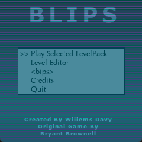
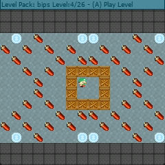
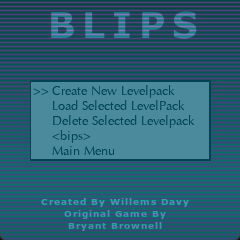
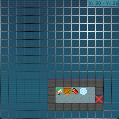
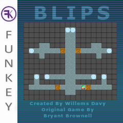

# Blips
   

Blips is a remake of the dos bips game made by Bryant Brownell for the funkey-s and RG Nano, its a sokoban style puzzle game but with exploding dynamite and collecting coins

## Screenshots

## Game Features:
- 26 Levels of original Bips game
- Level Editor (Create your own Level Packs)
- Adapted graphics over original gp2x game
- Autosaves progress

## Playing the Game:
The aim of the game is to collect all the dollar coins in a level, you need to create pathways to these coins by pushing boxes around or even make them explode by pushing them into the dynamite

## Controls Gamepad (xbox controller)

| Button | Action |
| ------ | ------ |
| A |	Confirm in menus, level selector and questions asked, place a part in the level editor |
| B | Quit to title screen on the level selector, Quit to level selector in game and level editor mode |
| Y | In Level editor Mode, Create a new level when being in the level selector. In the level editor itself erase all parts from the screen. Inside the game itself restart the level |
| X	| In the level editor, center the level on screen |
| DPAD |	move main player |
| L | At the level Selector decrease selected level with 5, In the level editor select previous part |
| R | At the level Selector increase selected level with 5,. In the level editor select next part. |
| L2 (SELECT + L) | Decrease Volume |
| R2 (SELECT + R) | Increase Volume |
| START | Test level when being in the level editor, go back to level editor after testing, Restart the current level |
| Y + JOYSTICK | When playing a level you can look around in the level freely |

## Preview for retrofe 

- Created by me but based on style made from other images by TommyShots from funkey discord

## Credits
Game is a remake of dos bips game made by Bryant Brownell (bryant.brownell@gmail.com) and based on the gp2x version i initially made

### Libraries
- SDL
- SDL_MIXER
- SDL_TTF
- SDL_GFX
- SDL_IMAGE

### Level authors
- Bryant Brownell
- Landon Brownell
- Caryn Brownell
- The PocoMan Team

### Music
Music was made by donskeeto

### Graphics
- dollar coin - [kenney game assets all in 1](https://kenney.itch.io/kenney-game-assets) - [CC0 1.0 Universal](https://creativecommons.org/publicdomain/zero/1.0/)
- wall: [1001.com](https://opengameart.org/content/sokoban-pack) - [Attribution-ShareAlike 3.0 Unported](https://creativecommons.org/licenses/by-sa/3.0/)
- floor: [Kenney Sokoban tiles](https://opengameart.org/content/sokoban-100-tiles) - [CC0 1.0 Universal](https://creativecommons.org/publicdomain/zero/1.0/)
- player: [Kenney Sokoban tiles](https://opengameart.org/content/sokoban-100-tiles) - [CC0 1.0 Universal](https://creativecommons.org/publicdomain/zero/1.0/)
- box: [SpriteAttack boxes and crates](https://opengameart.org/content/boxes-and-crates-svg-and-pngs) - [CC0 1.0 Universal](https://creativecommons.org/publicdomain/zero/1.0/)
- dynamite: [GUI Icons by Rexard](https://www.gamedevmarket.net/asset/gui-icons-8656) - I Payed for this asset do not reuse !

### Sound
- stageend.wav: [game music stingers and ui sfx pack 2](https://www.gamedevmarket.net/asset/game-music-stingers-and-ui-sfx-pack-2/) - I Payed for this Asset do not reuse !

